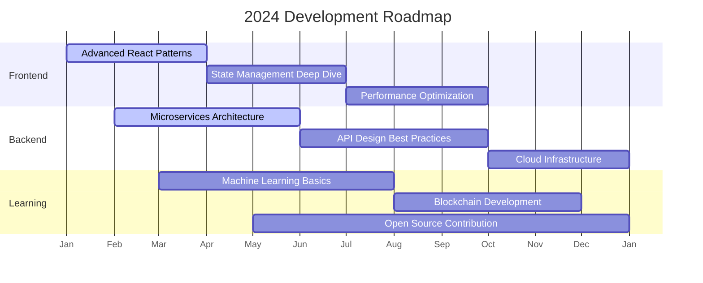

# 🎯 Tuấn Phong - Fullstack Developer Profile

<div align="center">
  
</div>

<div align="center">
  
</div>

<div align="center">
  
</div>

<div align="center">
  <a href="https://github.com/hoangtuanphong1a" target="_blank">
    
  </a>
  <a href="https://linkedin.com/in/yourprofile" target="_blank">
    
  </a>
  <a href="https://twitter.com/yourprofile" target="_blank">
    
  </a>
  <a href="mailto:your.email@example.com">
    
  </a>
</div>

<br/>

<div align="center">
  
  
</div>

## 🧠 About Me

```python
class Developer:
    def __init__(self):
        self.name = "Tuấn Phong"
        self.role = "Full Stack Developer"
        self.location = "Vietnam"
        self.experience = "4+ years"
        self.education = "Computer Science"
        
    def skills(self):
        return {
            "frontend": ["React", "Vue", "Angular", "Svelte", "TypeScript"],
            "backend": ["Node.js", "Python", "Java", "PHP", "Ruby"],
            "mobile": ["React Native", "Flutter", "Ionic"],
            "database": ["MySQL", "MongoDB", "PostgreSQL", "Redis"],
            "devops": ["Docker", "Kubernetes", "AWS", "Azure", "GCP"],
            "tools": ["Git", "Webpack", "Jest", "Cypress", "Figma"]
        }
    
    def interests(self):
        return [
            "Clean Code Architecture",
            "Performance Optimization", 
            "UI/UX Design",
            "Open Source",
            "Mentoring"
        ]
    
    def currently_learning(self):
        return ["Machine Learning", "Blockchain", "Rust"]
    
    def contact(self):
        return {
            "email": "your.email@example.com",
            "linkedin": "linkedin.com/in/yourprofile",
            "portfolio": "yourportfolio.com"
        }

me = Developer()
```

## 🛠️ Tech Stack

<div align="center">
  
### **Frontend Development**


### **Backend Development**


### **Database & Cloud**


### **Mobile Development**


</div>

## 📊 GitHub Analytics

<div align="center">
  
|  |  |
| :-: | :-: |


</div>

## 🎯 Current Focus



## 🌟 Featured Projects

<div align="center">
  
| <a href="https://github.com/hoangtuanphong1a/project1"></a> | <a href="https://github.com/hoangtuanphong1a/project2"></a> |
| :------------------------------------------------------------------------------------------------------------------------------------------------------------------------------------------: | :------------------------------------------------------------------------------------------------------------------------------------------------------------------------------------------: |

</div>

## 📈 Contribution Activity

[](https://github.com/ashutosh00710/github-readme-activity-graph)

## 📚 Latest Blog Posts

<div align="center">
  
- 🚀 [Building Scalable React Applications in 2024](https://dev.to/yourpost1)
- 🏗️ [Microfrontends: The Future of Frontend Architecture](https://dev.to/yourpost2)
- 📘 [Mastering TypeScript Advanced Patterns](https://dev.to/yourpost3)
- 🎨 [Creating Beautiful UI Animations with Framer Motion](https://dev.to/yourpost4)

</div>

## 🏆 Achievements

<div align="center">
  


</div>

## 🤝 Let's Connect!

<div align="center">
  
[](https://yourportfolio.com)
[](https://linkedin.com/in/yourprofile)
[](https://twitter.com/yourprofile)
[](https://dev.to/yourprofile)

</div>

<div align="center">
  


</div>

<div align="center">
  


</div>
