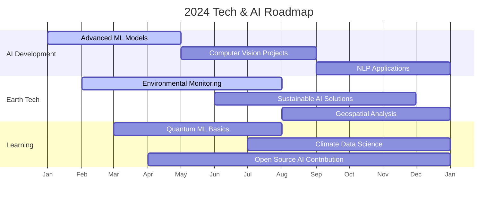

# 🚀 Tuấn Phong - Fullstack Developer Profile

<div align="center">
  
</div>

<div align="center">
  
</div>

<div align="center">
  
</div>

<div align="center">
  <a href="https://github.com/hoangtuanphong1a" target="_blank">
    
  </a>
  <a href="https://linkedin.com/in/yourprofile" target="_blank">
    
  </a>
  <a href="https://twitter.com/yourprofile" target="_blank">
    
  </a>
  <a href="mailto:your.email@example.com">
    
  </a>
</div>

<br/>

<div align="center">
  
  
</div>

## 🌍 Digital Earth & AI Vision

```python
class EarthAIDeveloper:
    def __init__(self):
        self.name = "Tuấn Phong"
        self.role = "Full Stack Developer & AI Enthusiast"
        self.location = "Vietnam"
        self.mission = "Building sustainable tech for our planet"
        self.experience = "4+ years"
        
    def tech_philosophy(self):
        return {
            "ai_ml": "Leveraging AI to solve real-world problems",
            "sustainability": "Green coding and efficient algorithms",
            "earth_tech": "Technology that respects our planet",
            "innovation": "Pushing boundaries with ethical tech"
        }
    
    def skills(self):
        return {
            "frontend": ["React", "Vue", "Svelte", "Three.js", "WebGL"],
            "backend": ["Node.js", "Python", "TensorFlow", "PyTorch", "FastAPI"],
            "ai_ml": ["Computer Vision", "NLP", "Predictive Analytics", "GANs"],
            "database": ["PostgreSQL", "MongoDB", "Redis", "Neo4j"],
            "cloud": ["AWS", "Google Cloud", "Azure AI", "IoT Core"],
            "devops": ["Docker", "Kubernetes", "CI/CD", "MLOps"]
        }
    
    def interests(self):
        return [
            "AI for Environmental Monitoring",
            "Smart Cities & IoT", 
            "Climate Tech Solutions",
            "Ethical AI Development",
            "Renewable Energy Systems"
        ]
    
    def currently_learning(self):
        return ["Quantum Computing", "Geospatial AI", "Bio-inspired Algorithms"]
    
    def contact(self):
        return {
            "email": "your.email@example.com",
            "linkedin": "linkedin.com/in/yourprofile",
            "portfolio": "earth-tech-portfolio.com"
        }

developer = EarthAIDeveloper()
```

## 🛠️ Tech & AI Stack

<div align="center">
  
### **AI & Machine Learning**


### **Frontend & 3D**


### **Backend & Cloud**


### **Data & IoT**


</div>

## 📊 GitHub Analytics

<div align="center">
  
|  |  |
| :-: | :-: |


</div>

## 🎯 2024 Tech Focus



## 🌟 Featured Projects

<div align="center">
  
| <a href="https://github.com/hoangtuanphong1a/ai-earth-monitor"></a> | <a href="https://github.com/hoangtuanphong1a/smart-city-iot"></a> |
| :------------------------------------------------------------------------------------------------------------------------------------------------------------------------------------------: | :------------------------------------------------------------------------------------------------------------------------------------------------------------------------------------------: |

</div>

## 📈 AI Contribution Activity

[](https://github.com/ashutosh00710/github-readme-activity-graph)

## 📚 Latest Tech Articles

<div align="center">
  
- 🤖 [AI for Environmental Conservation: A Developer's Guide](https://dev.to/yourpost1)
- 🌍 [Building Sustainable Tech: Green Coding Practices](https://dev.to/yourpost2)
- 🏙️ [Smart Cities: IoT and AI Integration Patterns](https://dev.to/yourpost3)
- 📊 [Geospatial Data Visualization with Three.js](https://dev.to/yourpost4)
- ⚡ [Quantum Machine Learning: The Next Frontier](https://dev.to/yourpost5)

</div>

## 🏆 Achievements

<div align="center">
  


</div>

## 🌐 Digital Presence

<div align="center">
  
### **Visitors Counter**


### **Coding Time**


### **Latest Tweet**
[](https://twitter.com/yourprofile)

</div>

## 🤝 Let's Connect & Collaborate!

<div align="center">
  
[](https://earth-tech-portfolio.com)
[](https://linkedin.com/in/yourprofile)
[](https://twitter.com/yourprofile)
[](https://dev.to/yourprofile)
[](https://kaggle.com/yourprofile)

</div>

<div align="center">
  


</div>

<div align="center">
  


</div>

---

<div align="center">
  
*"Technology is best when it brings people together and helps protect our planet."* - **Tuấn Phong**

</div>

<!-- Add some interactive elements -->
<script src="https://cdn.jsdelivr.net/nparticles.js"></script>
<script>
// Simple particle effect for tech theme
document.addEventListener('DOMContentLoaded', function() {
  // This would normally be a particles.js implementation
  console.log('Tech particles initialized');
});
</script>

<style>
  /* Add some tech-inspired animations */
  @keyframes tech-glow {
    0% { text-shadow: 0 0 5px #00FF00; }
    50% { text-shadow: 0 0 20px #00FF00, 0 0 30px #00FF00; }
    100% { text-shadow: 0 0 5px #00FF00; }
  }
  
  .tech-glow {
    animation: tech-glow 2s infinite;
  }
</style>
